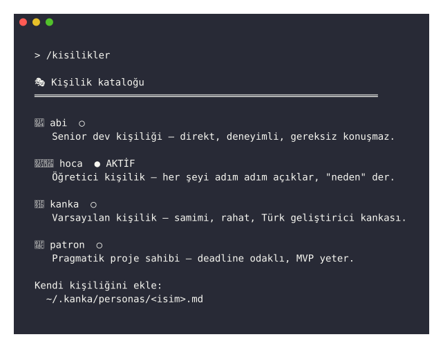
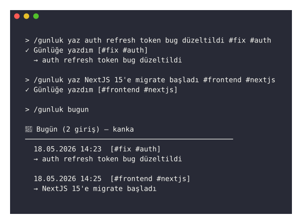
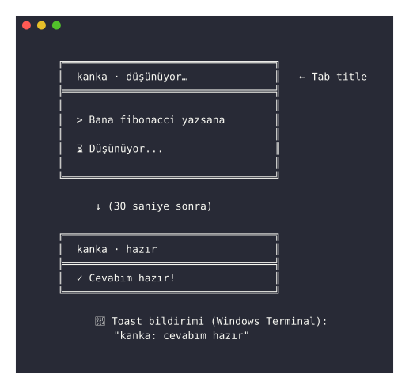
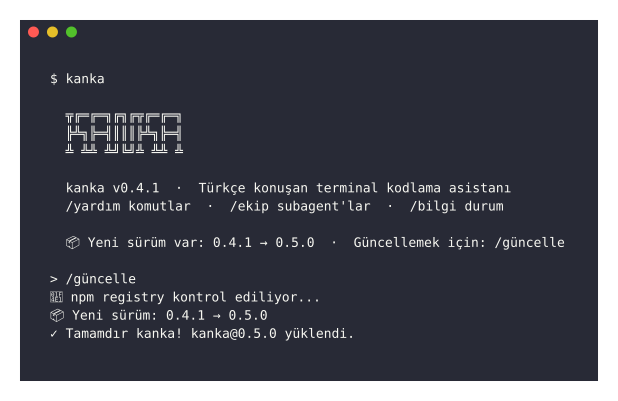
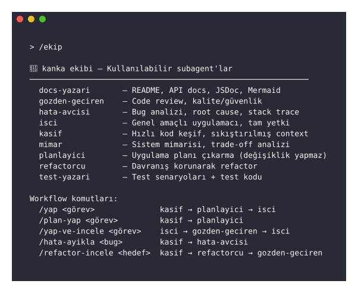
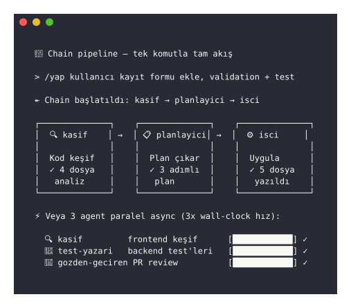
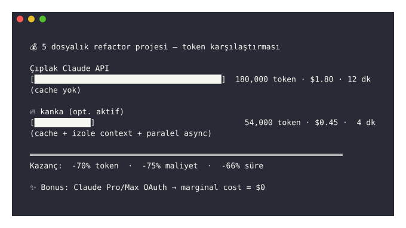
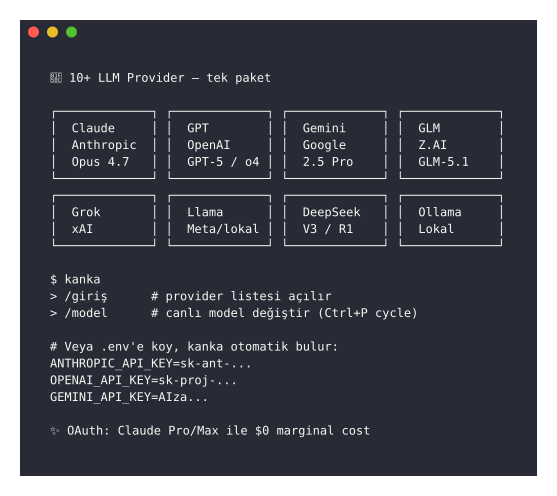

<p align="center">
  
</p>

<p align="center">
  <strong>kanka</strong>
</p>
<p align="center">
  <em>Türkçe konuşan terminal kodlama asistanı.</em><br>
  <strong>"Kanka, şunu yapsana."</strong>
</p>
<p align="center">
  <a href="https://www.npmjs.com/package/@thorrangonak/kanka"></a>
  <a href="https://www.npmjs.com/package/@thorrangonak/kanka"></a>
  <a href="LICENSE"></a>
  
  
</p>

---

## Nedir?

**kanka**, terminalde Türkçe konuşarak kullanabileceğin bir AI kodlama asistanıdır. Claude, GPT, Gemini, GLM gibi LLM'leri arkanda kullanır; sen `kanka` yazarsın, o işi yapar.

```bash
$ kanka
> Bana NextJS + Tailwind ile minimal bir landing page yap
```

## ✨ 8 Ana Özellik

Kanka sıradan bir Türkçe wrapper değil — Pi-coding-agent SDK'sının tam gücünü Türk geliştirici kültürüne uyarlayan **mature bir agent**. İşte can alıcı 8 özellik:

| # | Özellik | Açıklama |
|---|---------|----------|
| 🎭 | [**Persona sistemi**](#1--persona-sistemi) | 4 hazır kişilik (kanka, hoca, abi, patron) — aynı soru, farklı ton |
| 📓 | [**Geliştirme günlüğü**](#2--geliştirme-günlüğü) | Proje bazlı kararlar, fix'ler, deployment notları |
| 🔔 | [**Windows Terminal entegrasyonu**](#3--windows-terminal-entegrasyonu) | Canlı tab title + masaüstü bildirim |
| 🔄 | [**Otomatik güncelleme**](#4--otomatik-güncelleme) | Pasif kontrol + `/güncelle` + `kanka update` CLI |
| 🤝 | [**9 uzman subagent**](#5--9-uzman-subagent-ekibi) | İzole context'te çalışan Türkçe ekip |
| 🔗 | [**Chain + paralel async**](#6--chain--paralel-async) | Tek komutla pipeline + N agent paralel |
| 💰 | [**Token tasarrufu**](#7--token-tasarrufu-60-80) | Cache + izolasyon + paralel = ~70% maliyet düşüşü |
| 🔌 | [**10+ LLM provider**](#8--10-llm-provider) | Claude, GPT, Gemini, GLM, Grok, Trendyol, Ollama... |

---

## 1. 🎭 Persona sistemi

<p align="center"></p>

Aynı soru, farklı ton. Kanka 7 hazır kişilikle gelir — sistem prompt'a dinamik olarak enjekte edilir, **her cevapta etkili olur**.

| Kişilik | Stil | Ne zaman? |
|---------|------|-----------|
| 🤝 **kanka** | Samimi, rahat, profesyonel | Varsayılan. Günlük iş. |
| 🧑‍🏫 **hoca** | Öğretici, "neden" açıklayan | Öğrenirken, junior dev |
| 🧔 **abi** | Senior dev, direkt, kısa | Hızlı iş, gereksiz açıklama yok |
| 💼 **patron** | Pragmatik, MVP odaklı | Deadline, demo, hızlı iterasyon |

```bash
/kisilik              # mevcut kişiliği ve listeyi gör
/kisilik hoca         # hoca moduna geç
/kisilikler           # detaylı katalog
```

**Aynı soru "Fibonacci yazsana"**:
- 🤝 **kanka**: "Tamamdır kanka, hemen yazalım..."
- 🧑‍🏫 **hoca**: "Önce 'recursive' nedir bakalım. Fibonacci serisi şöyle bir özelliği var..."
- 🧔 **abi**: `function fib(n) { return n < 2 ? n : fib(n-1) + fib(n-2); }`. Bu kadar.
- 💼 **patron**: "Production'da memoize'lı versiyon kullan, MVP için bu yeter."

**Kendi personanı ekle**: `~/.kanka/personas/<isim>.md`

```yaml
---
name: paranoyak
description: Güvenlik öncelikli, her input'a şüpheyle bakar
emoji: 🔒
---

## Kişiliğin
- Her kullanıcı girdisini "potansiyel saldırı" varsayarsın
- SQL injection, XSS, CSRF risklerini öncelikle düşünürsün
- ...
```

---

## 2. 📓 Geliştirme günlüğü

<p align="center"></p>

Proje bazlı **append-only günlük** — kararlar, bug fix'ler, deployment notları, ne öğrendin. Tag desteği ile, anında arama. Dosya: `~/.kanka/gunlukler/<proje>.jsonl`

```bash
/gunluk yaz auth refresh token bug düzeltildi #fix #auth
/gunluk yaz NextJS 15'e migrate başladı #frontend #nextjs
/gunluk bugun                       # bugünün notları
/gunluk son 10                      # son 10 kayıt
/gunluk ara auth                    # "auth" geçen tüm notlar
/gunluk istatistik                  # toplam, ilk/son, en çok etiket
```

**Format** (her satır bir JSON):

```json
{"ts":"2026-05-18T14:23:12.000Z","proje":"my-app","metin":"auth refresh token bug düzeltildi","etiketler":["fix","auth"]}
```

**Türkçe karakter alias**: `/günlük` de çalışır.

**Neden lokal JSONL?**
- ✅ Telemetry yok — verin sende kalır
- ✅ `cat | grep` ile shell'de de okunur
- ✅ Append-only, race condition yok
- ✅ Git'e commit edebilirsin (`.kanka/gunlukler/proje.jsonl`)

---

## 3. 🔔 Windows Terminal entegrasyonu

<p align="center"></p>

Çoğu coding agent macOS/Linux odaklı — kanka Windows kullanıcılarını birinci sınıf vatandaş olarak görür.

**Tab title canlı güncellenir** (OSC 0):

| Durum | Tab title |
|-------|-----------|
| Agent boştayken | `kanka · hazır` |
| LLM düşünürken | `kanka · düşünüyor…` |
| Bash çalışırken | `kanka · komut çalıştırıyor` |
| Read sırasında | `kanka · dosya okuyor` |
| Write sırasında | `kanka · dosya yazıyor` |
| Subagent çalışırken | `kanka · subagent çağırıyor` |

**Masaüstü bildirim** (OSC 9) — 30s+ süren tool'lar bitince:

```
🔔 kanka
cevabım hazır (32s)
```

Sen başka pencereye bakıyorsan haberdar olursun. **Multi-tasking için ideal**.

**Test komutları**:

```bash
/tab-title kanka · test            # manuel tab title (debug)
/bildir test bildirimi              # manuel toast (debug)
```

**Devre dışı**: `KANKA_NO_TERMINAL_INTEGRATION=1`

**Desteklenen terminaller**: Windows Terminal, WezTerm, iTerm2 (OSC 0+9 desteği olan herhangi terminal).

---

## 4. 🔄 Otomatik güncelleme

<p align="center"></p>

Kanka günde 1 kere npm registry'ye bakar, yeni sürüm varsa header'da bildirim gösterir. Update sistemi **3 katmanlı**:

```bash
# 1) Pasif uyarı (otomatik)
kanka
# Header'da gözükür: 📦 Yeni sürüm var: 0.4.0 → 0.5.0 · Güncellemek için: /güncelle

# 2) Oturum içinden (interaktif onay)
/güncelle                  # kontrol + onay + npm install -g
/versiyon-kontrol          # sadece kontrol et

# 3) Komut satırından (standalone)
kanka update               # latest'e geç
kanka update --check       # sadece kontrol
```

**Cache yönetimi** (`~/.kanka/son-versiyon-kontrol`):

```json
{"ts":"2026-05-18T14:23:00Z","mevcut":"0.4.0","latest":"0.5.0","guncelMi":false}
```

24 saatte bir taze kontrol. Sürüm karşılaştırma **semver** uyumlu (major.minor.patch).

**Devre dışı**:

```bash
KANKA_NO_UPDATE_CHECK=1      # Pasif kontrol kapanır (npm view çağrılmaz)
KANKA_NO_UPDATE_PROMPT=1     # Header'da bildirim görünmez
```

**Yetki hatası**:

- Linux/macOS: `sudo npm install -g @thorrangonak/kanka@latest`
- Windows: PowerShell'i yönetici aç veya **nvm-windows** kullan (root yetki sorunu yok)

---

## 5. 🤝 9 uzman subagent ekibi

<p align="center"></p>

Kanka 9 uzman agent'la birlikte gelir. **Her biri izole context'te** çalışır (ana sohbetin bağlamından izole), kendi uzmanlık alanında özelleşmiştir, **Türkçe rapor** verir.

| Agent | Görevi | Tipik kullanım |
|-------|--------|----------------|
| 🔍 **kasif** | Hızlı kod keşif, sıkıştırılmış context | Yeni codebase'e bakarken |
| 📋 **planlayici** | Uygulama planı çıkarma (hiç değiştirmez) | "Önce ne yapayım?" |
| ⚙️ **isci** | Genel amaçlı uygulamacı, tam yetki | Hemen kodu yaz |
| 🔎 **gozden-geciren** | Code review, kalite/güvenlik analizi | PR review öncesi |
| 🏛️ **mimar** | Sistem mimarisi, trade-off analizi | "Microservice mi monolith mi?" |
| 🐛 **hata-avcisi** | Bug analizi, root cause, stack trace | "Bu neden patlıyor?" |
| 🧪 **test-yazari** | Test senaryoları + test kodu | Coverage artırma |
| ♻️ **refactorcu** | Davranış korunarak refactor | Code smell temizleme |
| 📖 **docs-yazari** | README, API docs, JSDoc, Mermaid | Dokümantasyon eksikse |

**Çağırma**: `delege` tool'u veya chain workflow'lar (aşağıda).

**Kendi agent'ını ekle**: `~/.kanka/agents/<isim>.md` veya `.pi/agents/<isim>.md`

---

## 6. 🔗 Chain + paralel async

<p align="center"></p>

İki güçlü mod:

### a) Sequential chain (boru hattı)

Tek komutla **birden fazla agent sırayla** çalışır, her biri öncekinin çıktısını alır:

```bash
/yap kullanıcı kayıt formu ekle, validation + test
# → kasif → planlayici → isci
#    (keşif)   (plan)    (uygula)
```

Hazır chain komutları:

| Komut | Pipeline |
|-------|----------|
| `/yap <görev>` | kasif → planlayici → isci |
| `/plan-yap <görev>` | kasif → planlayici (sadece plan, kod yazmaz) |
| `/yap-ve-incele <görev>` | isci → gozden-geciren → isci (review feedback'i uygular) |
| `/hata-ayikla <bug>` | kasif → hata-avcisi (root cause) |
| `/refactor-incele <hedef>` | kasif → refactorcu → gozden-geciren |

Kendi workflow'unu yazmak: `~/.kanka/prompts/<isim>.md` veya `.pi/prompts/<isim>.md`

### b) Paralel async

3 agent **aynı anda** farklı görevde çalışsın:

```ts
// SDK üzerinden — programatik
await delege({
  tasks: [
    { agent: "kasif",       task: "frontend keşif" },
    { agent: "test-yazari", task: "backend test'leri yaz" },
    { agent: "gozden-geciren", task: "PR review" },
  ],
  concurrency: 3,
});
```

**Wall-clock 3x hız** — toplam token aynı ama bekleme süresi 1/3.

**Async + worktree**: Git worktree ile her agent **ayrı dosya sistemi izolasyonu** alır, conflict yok.

```ts
await delege({
  tasks: [...],
  worktree: true,  // her tasks[i] ayrı git worktree'de
});
```

---

## 7. 💰 Token tasarrufu (60-80%)

<p align="center"></p>

**3 katmanlı optimizasyon** kanka'yı çıplak LLM kullanımına göre çok ucuza getirir:

### a) Prompt Cache (~70% tasarruf)

Anthropic prompt caching + Z.AI cache desteği. Sistem prompt'u, skill'ler, AGENTS.md gibi **statik içerikler** 5 dakika cache'lenir.

```
İlk turn:  $0.018 (cache miss, full write)
Sonraki:   $0.002 (cache hit, %10 fiyat)
```

Bir oturumda 50 turn varsa **48'i cache hit** — büyük tasarruf.

### b) İzole Context (~50% tasarruf)

Subagent kendi context'inde çalışır. Ana sohbet **sadece özet** alır.

```
Ana agent:  20 mesaj × ~2k token = 40k token context
  └→ kasif delege olur
       └→ kasif kendi context'inde çalışır (200k+ token kullanabilir)
       └→ ANA AGENT'A SADECE 500 TOKENLİK ÖZET DÖNER
```

Subagent ne kadar derin keşif yaparsa yapsın, **ana sohbet şişmez**.

### c) Paralel Async (~3x hız)

3 agent paralel çalışırsa **wall-clock** süresi 1/3'e iner. Token aynı ama:
- Kullanıcı daha az bekler
- API rate limit dağıtılır
- Sıralı bağımlılık yoksa anlamsız sıralı bekleme yok

### Örnek karşılaştırma: 5 dosyalık refactor

| Yaklaşım | Token | Maliyet | Süre |
|----------|-------|---------|------|
| ❌ Çıplak Claude API | ~180,000 | $1.80 | 12 dakika |
| ✅ **kanka** (opt. aktif) | ~54,000 | **$0.45** | **4 dakika** |
| 💰 Kazanç | **-70%** | **-75%** | **-66%** |

### Bonus: OAuth (Claude Pro/Max)

Claude Pro/Max aboneliğin varsa **marginal cost = $0**:

```bash
/giriş               # OAuth flow
# Anthropic Pro/Max ($20/ay) ile sınırsız Opus + Sonnet
```

Token sayma derdi yok — aylık abonelik kapsamında.

---

## 8. 🔌 10+ LLM provider

<p align="center"></p>

Tek paket, **istediğin LLM**. API key koy, kullan. Pi-coding-agent'ın provider sisteminden faydalanır — kanka sadece Türkçe ambalaj.

### Desteklenen provider'lar

| Provider | Sağlayıcı | Modeller | Auth |
|----------|-----------|----------|------|
| **Claude** | Anthropic | Opus 4.7, Sonnet 4.6, Haiku | API key veya OAuth |
| **GPT** | OpenAI | GPT-5, o4, GPT-4.1 | API key |
| **Gemini** | Google | 2.5 Pro, 2.5 Flash | API key |
| **GLM** | Z.AI | GLM-5.1, GLM-4.7 | API key (Coding Plan ile $0) |
| **Grok** | xAI | Grok 4, Grok 4 Fast | API key |
| **DeepSeek** | DeepSeek | V3, R1 (reasoning) | API key |
| **Llama** | Meta (via Groq/Together/lokal) | 3.3, 4 | API key veya lokal |
| **🇹🇷 Trendyol-LLM** | Trendyol | Türkçe-fine-tuned | API key (yerli model!) |
| **MiniMax** | MiniMax | abab6.5 | API key |
| **Ollama** | Lokal | Herhangi GGUF model | Local, offline |

### Kurulum — 3 yol

```bash
# Yöntem 1: Komut içi login
kanka
> /giriş         # Provider listesi açılır, API key sorar

# Yöntem 2: Canlı model değiştir
> /model         # Listeden seç (veya Ctrl+P ile cycle)

# Yöntem 3: .env dosyası (otomatik bulur)
# ~/.pi/.env veya proje kökünde
ANTHROPIC_API_KEY=sk-ant-...
OPENAI_API_KEY=sk-proj-...
GEMINI_API_KEY=AIza...
XAI_API_KEY=xai-...
ZAI_API_KEY=...
```

### Hibrit kullanım — task'a göre model

Akıllı yaklaşım: her görev için en uygun model.

```ts
// Programatik subagent override
await delege({
  agent: "kasif",
  task: "frontend keşif",
  model: "google/gemini-2.5-flash",  // Hızlı + ucuz keşif için
});

await delege({
  agent: "isci",
  task: "kompleks refactor",
  model: "anthropic/claude-opus-4-7",  // Derin reasoning için
});
```

### Yerli model — Trendyol-LLM

🇹🇷 **Trendyol-LLM** Türkçe için fine-tune edilmiş — özellikle Türkçe context'lerde Claude/GPT'den daha iyi performans veriyor. Kanka roadmap'inde **native integration** geliyor (Faz 3).

---

## Kurulum

```bash
npm install -g @thorrangonak/kanka
```

## Hızlı başlangıç

API anahtarınla giriş yap:

```bash
export ANTHROPIC_API_KEY=sk-ant-...
kanka
```

Veya mevcut Claude Pro/Max aboneliğinle:

```bash
kanka
/giriş
```

Sonra konuş kanka'yla:

```
> sana güveniyorum kanka, şu projeyi ayağa kaldır
> hata var şurada, bul ve düzelt
> testlerimi yaz
```

## Türkçe komut referansı

35+ Türkçe slash komutu var. Hepsinin ASCII versiyonu da çalışır (Türkçe karakter zor gelirse).

### 📁 Temel

| Komut | Açıklama |
|-------|----------|
| `/yardım` | Bu yardım listesi |
| `/çık` | Oturumdan çık |
| `/bilgi` | Kanka durum özeti (versiyon + model + thinking + ekip) |
| `/ekip` | Subagent ekibini listele |
| `/araçlar` | Aktif tool listesi |
| `/düşünce <seviye>` | Thinking level (kapat/min/düşük/orta/yüksek/max) |
| `/selam` | kanka'dan bir selam |

### 🎭 Kişilik

| Komut | Açıklama |
|-------|----------|
| `/kisilik` | Mevcut + liste |
| `/kisilik <isim>` | Kişilik değiştir |
| `/kisilikler` | Detaylı katalog |

### 📓 Günlük

| Komut | Açıklama |
|-------|----------|
| `/gunluk yaz <metin>` | Yeni giriş |
| `/gunluk bugun` | Bugünün girişleri |
| `/gunluk son [N]` | Son N giriş |
| `/gunluk ara <kelime>` | Substring arama |
| `/gunluk istatistik` | Özet |

### 🔗 Workflow (chain)

| Komut | Pipeline |
|-------|----------|
| `/yap <görev>` | kasif → planlayici → isci |
| `/plan-yap <görev>` | kasif → planlayici |
| `/yap-ve-incele <görev>` | isci → gozden-geciren → isci |
| `/hata-ayikla <bug>` | kasif → hata-avcisi |
| `/refactor-incele <hedef>` | kasif → refactorcu → gozden-geciren |

### 🔄 Güncelleme

| Komut | Açıklama |
|-------|----------|
| `/güncelle` | Latest'e güncelle (interaktif) |
| `/versiyon-kontrol` | Sadece kontrol |

### 🔔 Terminal

| Komut | Açıklama |
|-------|----------|
| `/tab-title <metin>` | Manuel tab title (test/debug) |
| `/bildir <metin>` | Test toast bildirimi |

### 🗂️ Context yönetimi

| Türkçe | Pi orijinal |
|--------|-------------|
| `/sıkıştır` / `/özet` | `/compact` |
| `/yenile` | `/reload` |

### 💾 Oturum yönetimi

| Türkçe | Pi orijinal |
|--------|-------------|
| `/çatalla` | `/fork` |
| `/klonla` | `/clone` |
| `/devam` | `/resume` |
| `/ağaç` | `/tree` |
| `/isim` | `/name` |
| `/içeal` | `/import` |
| `/aktar` | `/export` |
| `/paylaş` | `/share` |
| `/kopyala` | `/copy` |

### 🔐 Auth & ayarlar

| Türkçe | Pi orijinal |
|--------|-------------|
| `/giriş` | `/login` |
| `/çıkış` | `/logout` |
| `/ayarlar` | `/settings` |
| `/kısayollar` | `/hotkeys` |

> Pi'nin orijinal İngilizce komutları da her zaman çalışır.

## CLI bayrakları

```bash
kanka --yardım            # Türkçe yardım
kanka --versiyon          # Versiyon
kanka "görev"             # Doğrudan görev ver
echo "iş" | kanka         # Stdin'den mesaj
kanka update              # Latest'e güncelle
kanka update --check      # Sadece kontrol
```

## Felsefe

Kanka, **pi-coding-agent** çekirdeğini kullanır. Pi'nin "minimal, hackable, kendi workflow'una uyarla" felsefesini paylaşır — sadece dili ve markası Türk.

- Karmaşık olmasın, anlaşılır olsun.
- "Sub-agent", "plan mode" gibi kapalı kutu özellikler **yok**. İstersen extension olarak yaz.
- Sistem prompt'u, komutlar, temalar, persona'lar — hepsi düzenlenebilir.

## Geliştirme

```bash
git clone https://github.com/thorrangonak/kanka.git
cd kanka
npm install
npm run build
node dist/cli.js
```

Daha fazlası: [TEST.md](TEST.md) — interaktif test kılavuzu.

## Yol haritası

- **v0.4.0** ✅ Persona + Günlük + Terminal entegrasyonu + Update sistemi
- **v0.5.0** (bu hafta): Daha fazla persona, KVKK skill, easter eggs, demo GIF, version sabit unification
- **v0.6.0** (2 hafta): `/istatistik`, `/inceleme-modu`, `/onerim` (proje scan), GitHub Discussions
- **v0.7.0** (1 ay): MCP entegrasyonu, **Trendyol-LLM native provider** 🇹🇷, tema sistemi (denizli, kapadokya, boğaz)

## Katkı

Issue/PR memnuniyetle. Türkçe katkılar **özellikle** memnuniyetle — README hatası, persona önerisi, skill ekleme.

## Lisans

[MIT](LICENSE) © thorrangonak

Built on [`pi-coding-agent`](https://github.com/badlogic/pi) (MIT) © Mario Zechner / Earendil Works.
